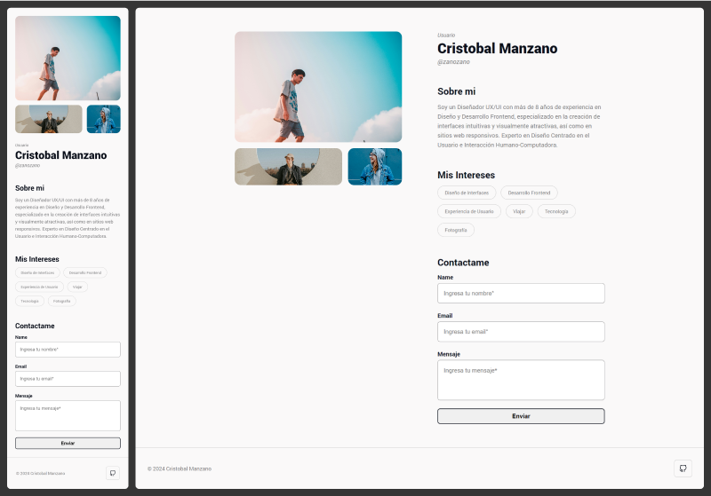

# user-profile / Prueba Tecnica

*** Esta rama esta limpia de Test ya que la dependencia de @testing-library/react-hooks causaba conflicto.

Este proyecto es una prueba técnica desarrollada con Next.js 14 y React para la implementación de un front-end de un perfil de usuario. Se ha puesto un fuerte énfasis en mejorar la experiencia del usuario mediante un diseño de interfaz simple pero atractivo. Se implementaron CSS Modules para una gestión y escalabilidad eficiente de estilos. Además, se incluyó Framer Motion para la animación de carga de imágenes y Animate.css para la animación de carga de bloques de texto, enriqueciendo así la experiencia del usuario.




## Instalación y Ejecución

Para levantar el proyecto localmente, sigue estos pasos:

1. **Clona el repositorio:**
   ```bash
   git clone https://github.com/zanozano/user-profile.git
   cd user-profile
   ```

2. **Instala las dependencias:**
   ```bash
   npm install
   ```

3. **Ejecuta el proyecto en modo desarrollo:**
   ```bash
   npm run dev
   ```

   Esto iniciará el servidor de desarrollo en [http://localhost:3000](http://localhost:3000).

## Estructura del Proyecto

El proyecto está estructurado de la siguiente manera:

- **components/**: Contiene los componentes React utilizados en las diferentes secciones de la página.
- **hooks/**: Aquí se encuentra el hook `useContactForm` para el formulario de contacto.
- **styles/**: Archivos CSS y CSS Modules para estilizar la aplicación.
- **data/**: Archivo JSON para manejar textos globales del front-end.

## Pruebas Unitarias

Se ha incluido una prueba unitaria utilizando Jest para el hook `useContactForm`. Puedes encontrar la prueba en la carpeta `tests/`.

Para ejecutar las pruebas, utiliza el siguiente comando:
```bash
npm test
```

## Dependencias Principales

- **next**: 14.2.4
- **react**: ^18
- **react-dom**: ^18
- **animate.css**: ^4.1.1
- **framer-motion**: ^11.2.12
- **sweetalert2**: ^11.12.1

## Dependencias de Desarrollo

- **eslint**: ^8
- **eslint-config-next**: 14.2.4
